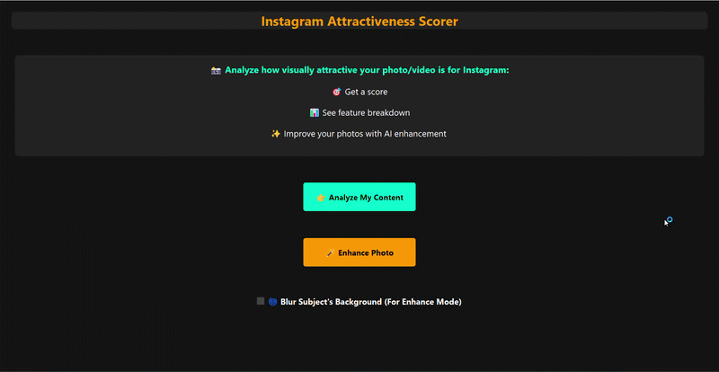
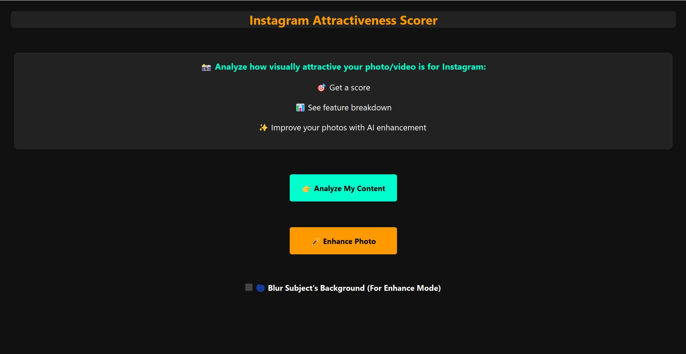
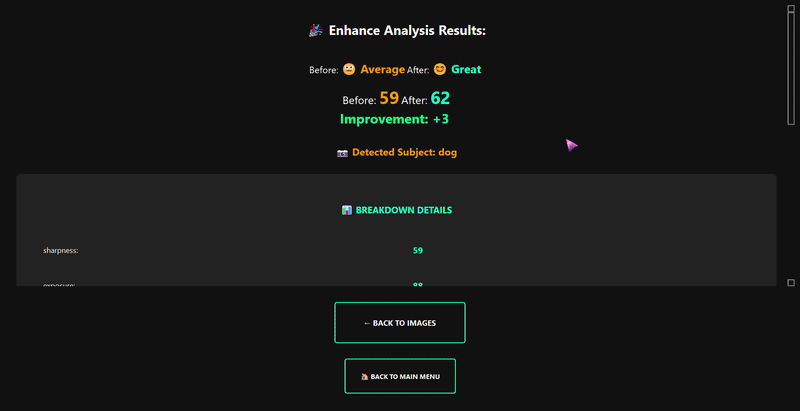
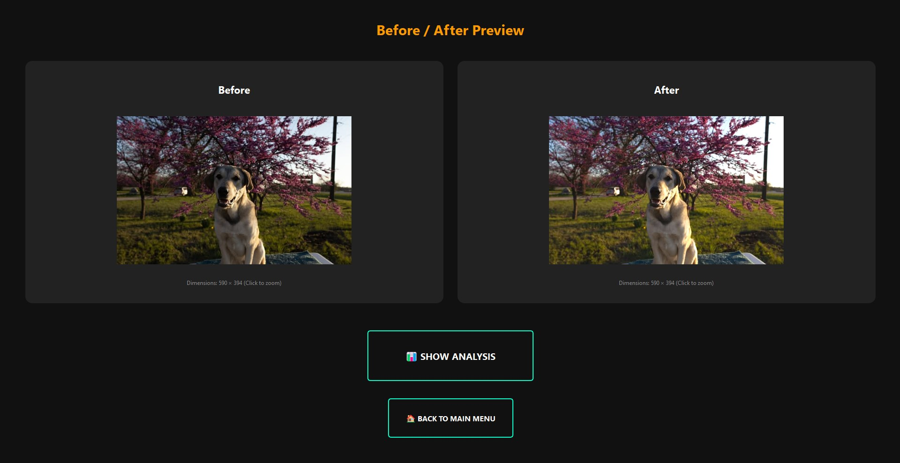

# 📸 Instagram Attractiveness Scorer

<p align="center">
  
</p>

<p align="center">
  <b>🎯 Score • 📊 Analyze • ✨ Enhance</b><br>
  AI-powered Instagram photo and video quality analysis using YOLOv8, OpenCV, and Computer Vision.
</p>

---

## ✨ Features

### 📷 Image Analysis

* Sharpness Detection
* Exposure Evaluation
* Contrast Analysis
* Colorfulness Measurement
* Saturation Assessment
* Subject Detection using YOLOv8
* Subject Composition & Position Scoring

### 🎥 Video Analysis

* Video Stability (Shake Detection)
* Jump Cut Detection
* Frame Quality Analysis
* Subject Detection

### 🪄 Photo Enhancement

The application can automatically improve photos by:

* Increasing sharpness
* Adjusting exposure
* Improving contrast
* Enhancing saturation
* Highlighting the main subject
* Optional background blur using YOLOv8 Segmentation

---

## 🧠 Technologies Used

* Python
* OpenCV
* NumPy
* YOLOv8
* PyQt5
* Matplotlib
* Pillow

---

## 📊 Scoring System

The attractiveness score is calculated using a weighted combination of:

| Feature         | Description                        |
| --------------- | ---------------------------------- |
| Sharpness       | Image clarity and focus            |
| Exposure        | Lighting quality                   |
| Contrast        | Visual depth                       |
| Colorfulness    | Vibrancy of colors                 |
| Saturation      | Color intensity                    |
| Subject Score   | Subject prominence and composition |
| Video Stability | Camera shake evaluation            |
| Jump Cuts       | Editing quality for videos         |

Final scores range from **0 to 100**.

---

## 🚀 Installation

Clone the repository:

```bash
git clone https://github.com/melofy-vibes/Instagram-Attractiveness-Scorer.git
cd Instagram-Attractiveness-Scorer
```

Install dependencies:

```bash
pip install -r requirements.txt
```

Download YOLO models:

* yolov8n.pt
* yolov8s-seg.pt

Place them inside the project root folder.

---

## ▶️ Run

```bash
python app.py
```

---

## 📸 Screenshots

### 🏠 Main Window



The application's home screen with analysis and enhancement options.

---

### 📊 Analysis Results



Detailed attractiveness score with feature breakdown and visual insights.

---

### ✨ Before vs After Enhancement



AI-powered photo enhancement with automatic quality improvements.

---

## 🎯 Future Improvements

* UI improvements
* Adjustments with less sensitivity
* Batch image processing
* AI-based caption suggestions

---

## ⚠️ Disclaimer

This project evaluates visual characteristics commonly associated with social-media aesthetics. The score does not represent objective beauty or personal value.

---

## 👩‍💻 Author

Developed by Mehraveh using Python and Computer Vision.


